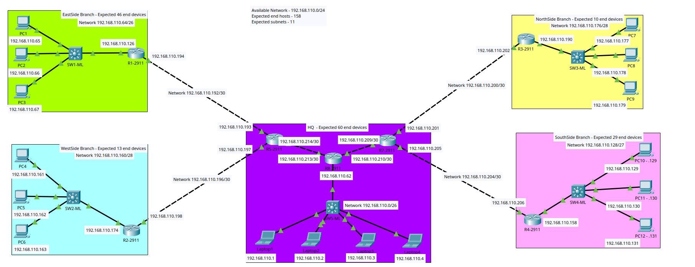

# XYZ Limited Enterprise Network Simulation

## Overview

This project is a Cisco Packet Tracer simulation of the **XYZ Limited Enterprise Network**, designed using **VLSM (Variable Length Subnet Masking)** to efficiently allocate IP address space based on the number of hosts required at each site.

The network consists of a Headquarters (HQ) and four branch offices connected through point-to-point WAN links. The implementation includes:

- Network design and topology planning
- VLSM subnetting
- IP addressing
- Router and switch configuration
- Static routing
- End-to-end connectivity testing

All devices across all locations can successfully communicate with one another, confirming that the routing and addressing scheme has been implemented correctly.

---

## Network Topology



### Sites Included

| Site | Expected End Devices |
|--------|---------------------|
| Headquarters (HQ) | 60 |
| EastSide Branch | 46 |
| SouthSide Branch | 29 |
| WestSide Branch | 13 |
| NorthSide Branch | 10 |

---

## Design Objectives

The network was designed to:

- Support communication between all branches and HQ.
- Minimize IP address wastage using VLSM.
- Implement static routing between all routers.
- Provide scalability for future expansion.
- Demonstrate enterprise WAN connectivity concepts.

---

# IP Addressing Plan

## Available Address Space

**Base Network:** `192.168.110.0/24`

---

## LAN Networks

| Location | Network Address | Subnet Mask | CIDR | Usable Host Range | Broadcast |
|-----------|----------------|-------------|------|------------------|------------|
| HQ | 192.168.110.0 | 255.255.255.192 | /26 | 192.168.110.1 - 192.168.110.62 | 192.168.110.63 |
| EastSide Branch | 192.168.110.64 | 255.255.255.192 | /26 | 192.168.110.65 - 192.168.110.126 | 192.168.110.127 |
| SouthSide Branch | 192.168.110.128 | 255.255.255.224 | /27 | 192.168.110.129 - 192.168.110.158 | 192.168.110.159 |
| WestSide Branch | 192.168.110.160 | 255.255.255.240 | /28 | 192.168.110.161 - 192.168.110.174 | 192.168.110.175 |
| NorthSide Branch | 192.168.110.176 | 255.255.255.240 | /28 | 192.168.110.177 - 192.168.110.190 | 192.168.110.191 |

---

## WAN Point-to-Point Networks

| Link | Network | CIDR | Router IPs |
|--------|---------|------|------------|
| HQ ↔ EastSide | 192.168.110.192/30 | /30 | .193 ↔ .194 |
| HQ ↔ WestSide | 192.168.110.196/30 | /30 | .197 ↔ .198 |
| HQ ↔ NorthSide | 192.168.110.200/30 | /30 | .201 ↔ .202 |
| HQ ↔ SouthSide | 192.168.110.204/30 | /30 | .205 ↔ .206 |
| HQ Internal Link 1 | 192.168.110.208/30 | /30 | .209 ↔ .210 |
| HQ Internal Link 2 | 192.168.110.212/30 | /30 | .213 ↔ .214 |

---

# Router Information

| Router | Location |
|----------|----------|
| R1-2911 | EastSide Branch |
| R2-2911 | WestSide Branch |
| R3-2911 | NorthSide Branch |
| R4-2911 | SouthSide Branch |
| R5-2911 | HQ |
| R7-2911 | HQ |
| R8-2911 | HQ Core Router |

---

# Network Devices

## Routers

- Cisco 2911 Integrated Services Routers
- Static routing configured on all routers

## Switches

- Multilayer Switches (ML Switches)
- Used for local LAN connectivity

## End Devices

- PCs at branch offices
- Laptops at Headquarters

---

# VLSM Allocation Process

The subnetting strategy was based on host requirements.

| Requirement | Allocated Subnet |
|-------------|------------------|
| 60 Hosts | /26 |
| 46 Hosts | /26 |
| 29 Hosts | /27 |
| 13 Hosts | /28 |
| 10 Hosts | /28 |
| WAN Links | /30 |

This approach ensures efficient utilization of the available `192.168.110.0/24` address space while providing room for future growth.

---

# Routing Configuration

Static routing was implemented throughout the network.

### Benefits

- Simple implementation
- Full administrative control
- Predictable routing paths
- Suitable for small to medium-sized enterprise networks

Each router contains routes to all remote LANs and WAN networks, enabling full connectivity across the enterprise.

---

# Connectivity Verification

The following tests were successfully completed:

- PC-to-PC communication within the same LAN
- Branch-to-HQ communication
- Branch-to-Branch communication
- End-to-end ping testing across all networks
- Router-to-router connectivity verification

### Result

✅ All devices can successfully ping one another.

This confirms:

- Correct VLSM implementation
- Proper IP addressing
- Accurate static route configuration
- Functional WAN connectivity

---

# Skills Demonstrated

This project demonstrates practical knowledge of:

- Enterprise Network Design
- Cisco Packet Tracer
- VLSM Subnetting
- IPv4 Address Planning
- Static Routing
- Router Configuration
- Switch Configuration
- WAN Design
- Troubleshooting and Connectivity Testing

---

# Future Improvements

Potential enhancements include:

- Dynamic routing protocols (OSPF, EIGRP, RIP)
- VLAN implementation
- DHCP services
- NAT and PAT
- Access Control Lists (ACLs)
- Redundancy and failover links
- Network security hardening
- Internet connectivity simulation

---

# Repository Structure

```text
XYZ-Limited-Network/
│
├── README.md
├── XYZ_Limited_Network.pkt
├── topology.png

```

---

# Author

**Kevin Njogu**

Cisco Packet Tracer Lab Project – XYZ Limited Enterprise Network

---

# License

This project is intended for educational and learning purposes.
